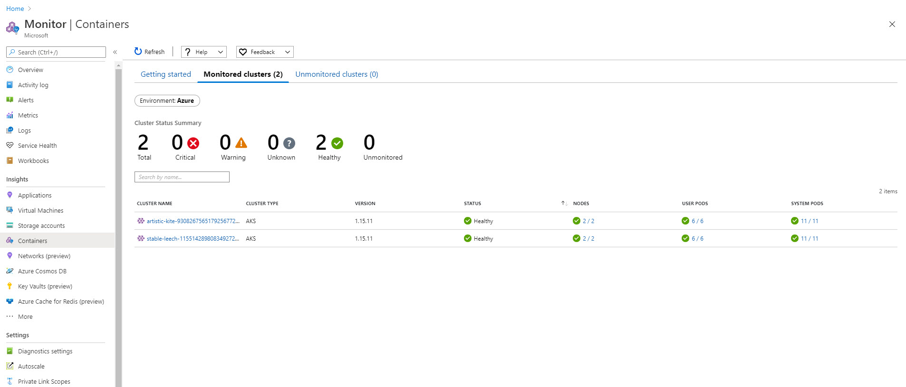
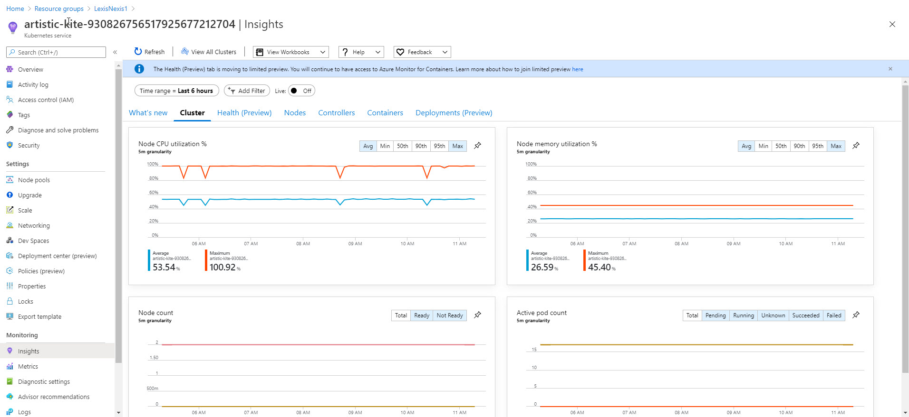
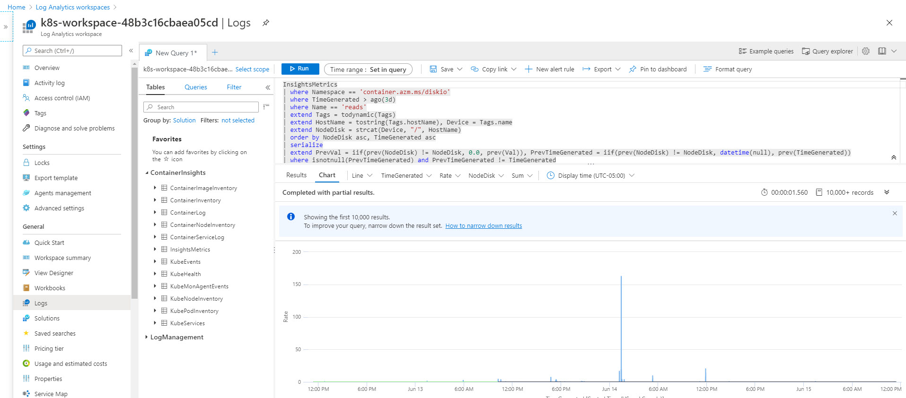

# How to setup monitoring for AKS

[Azure Monitor For Containers](https://docs.microsoft.com/en-us/azure/azure-monitor/insights/container-insights-overview)

## Create a log analytics workspace 

```ruby

resource "azurerm_log_analytics_workspace" "primary" {
  name                = var.name_of_workspace
  location            = var.location
  resource_group_name = var.resource_group_name
  sku                 = "PerGB2018"
}

resource "azurerm_log_analytics_solution" "primary" {
  solution_name         = "ContainerInsights"
  location              = var.location
  resource_group_name   = var.resource_group_name
  workspace_resource_id = azurerm_log_analytics_workspace.primary.id
  workspace_name        = azurerm_log_analytics_workspace.primary.name

  plan {
    publisher = "Microsoft"
    product   = "OMSGallery/ContainerInsights"
  }
}

```

## Add Azure Monitors for Containers agent to AKS

```ruby

resource "azurerm_kubernetes_cluster" "default" {  
 
  addon_profile{   
    oms_agent{
      enabled = true
      log_analytics_workspace_id = azurerm_log_analytics_workspace.primary.id      
    }
  }

  

}

```








# Use Prometheus to get more detailed metrics

[Prometheus Integration with Azure Monitor](https://docs.microsoft.com/en-us/azure/azure-monitor/insights/container-insights-prometheus-integration)

[Prometheus YAML](https://github.com/microsoft/OMS-docker/blob/ci_feature_prod/Kubernetes/container-azm-ms-agentconfig.yaml)

1. See already modified `container-azm-ms-agentconfig.yaml` in this repo.
**Note:** if using straight from source, annotations need be added at the bottom.
2. Configure settings (if needed)
3. Apply YAML using kubectl
```sh
kubectl apply -f container-azm-ms-agentconfig.yaml
```

